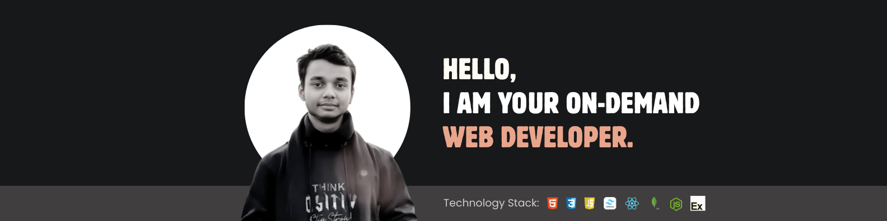

<!--- banner --->

<!--- header --->
<h1 align="center">Hi 👋, I'm Azizur Rahman Bappy</h1>
<h3 align="center">I’m a Mern Stack web developer passionate about making error-free websites.</h3>

 

- 👋 Hi, I’m **[@azizurrbappy](https://github.com/azizurrbappy)**
- 🖥️ I’m currently working on **HTML, CSS, React.js** for frontend development.
- 🗄️ Using **Node.js, Express.js, MongoDB** for the backend.
- 💬 Ask me about **Mern-Stack (React, Node, Express, MongoDB)**.
- 🌐 Explore My Portfolio **[Azizur Rahman Bappy]()** and My **[Resume]()**
- 📝 I regularly write articles on **[LinkedIn]()**
- 📫 Feel free to reach me out **[Email](azizurr.bappy@gmail.com)**

## Technology Stack:

#### Languages:

#### CSS And JavaScript Frameworks & Libraries:

#### Database & Model:

#### Deployment Platform:

#### Design & Graphics:

#### Tools & Technologies:

## ☕ Connect with me!
    

## 📧 For Business Inquiries 
✅  ► azizurr.bappy@gmail.com
